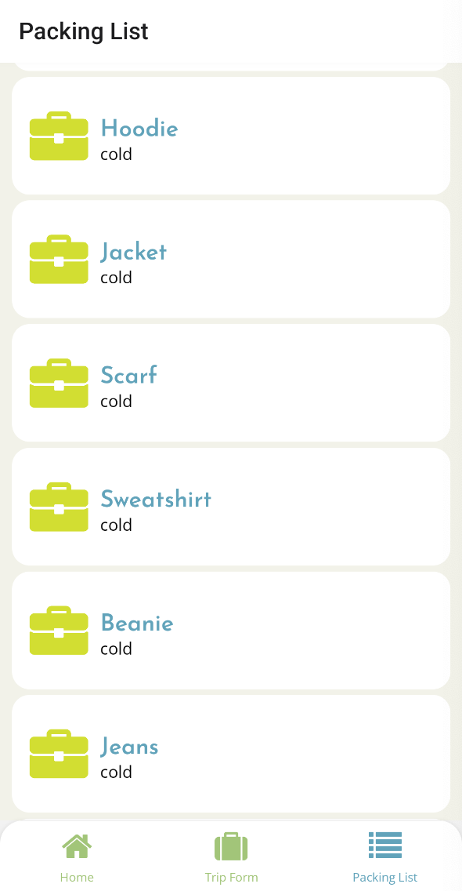

## Packing Helper

## Project Statement:

Packing Helper is a mobile app that will help you pack for your next trip! You enter your destination and time frame for the trip, and the app will generate a packing list based on the weather. Our app uses React Native and TypeScript for the technology stack and the Google Autocomplete API to make it easier for you to search for the location. It also uses the OpenWeather API for the temperature of the location you entered.

## Improvements:

In the future there will be the ability to personalize your clothing preferences. For example, someone may or may not wear dresses and skirts. There would also be the ability to add more clothing or accessory items that we do not automatically generate.

Currently the weather API only generates the current weather for the travel destination. In the future we will implement the weather API so that it will forecast the weather for the trip. Due to an unknown error, we were not able to implement the weather API in this way before submitting the project.

**Additional Goals:**

- Ability to add preferences to the clothing items suggested
- A personalized logo for the app
- A suggested list is created and users can remove or add items to their liking
- Offer a packing list based on a weight limit
- Ability to create a profile and save your packing lists

## Images of deployed App:

Home:

Form:

Packing List:


## Stack

- [Expo](https://expo.dev/)

## Prerequisites

- [Node.js](https://nodejs.org/)
- [npm](https://docs.npmjs.com/downloading-and-installing-node-js-and-npm)

## Install

Clone the repository:

```sh
git clone https://github.com/michaelabudde/packing-helper.git
cd gdi-hack23-pathways-to-independence
```

Install the dependencies:

```sh
npm install
```

## Run

Before running the app, open the android Virtual Device Simulator.

Start the app:

```sh
npm run android
```

Lint code style:

```sh
npm run lint
```

Type check:

```sh
npm run lint:tsc
```

Run tests:

```sh
npm test
```
